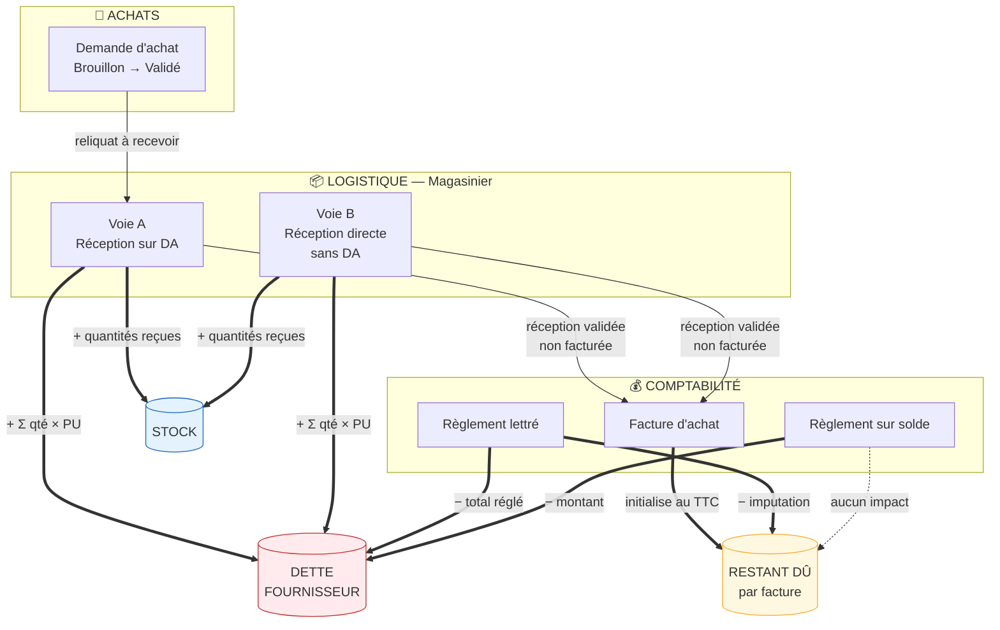
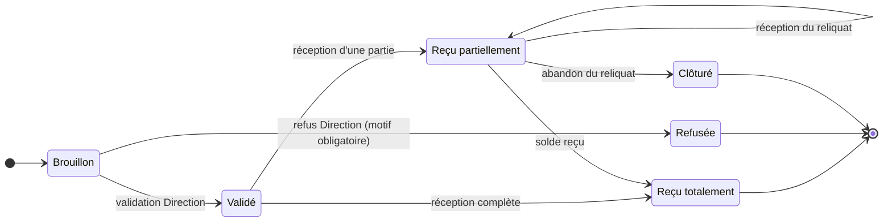
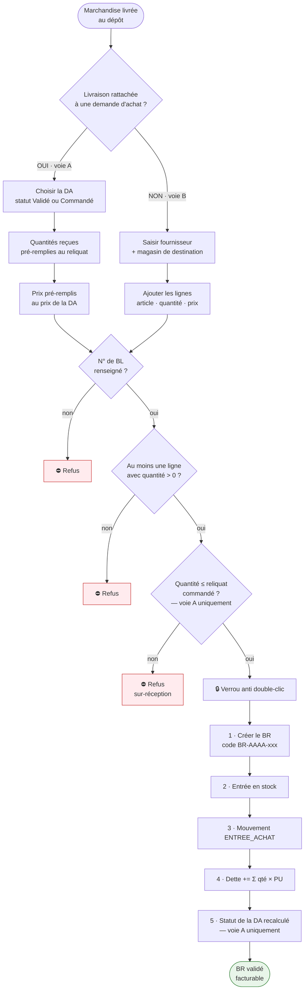
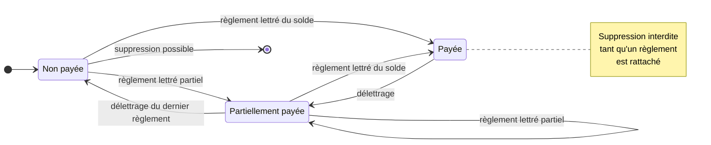
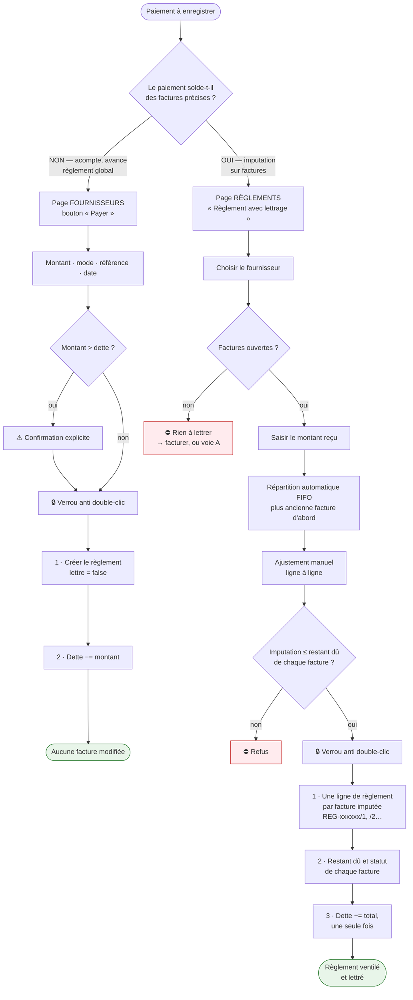
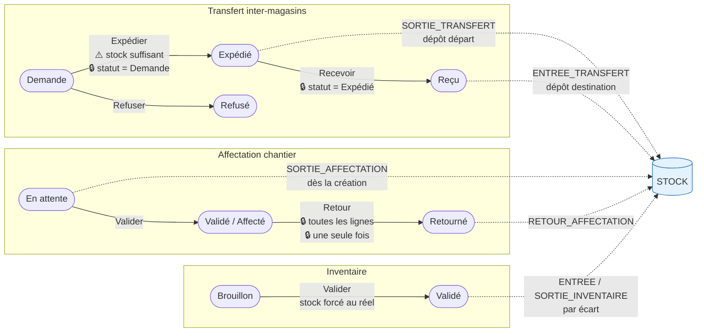
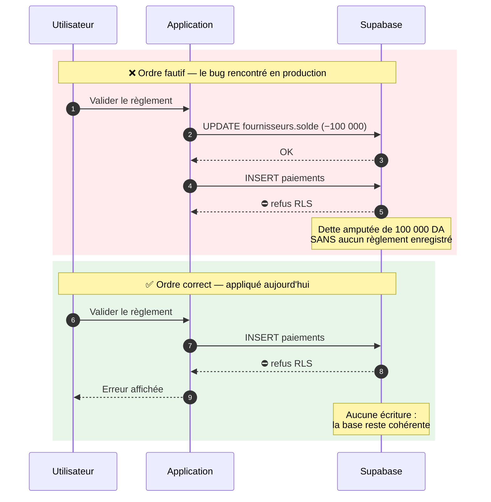

# Workflow professionnel — BGM Central (gestion multi-magasins)

> Document de référence : processus cible, règles de gestion, contrôles obligatoires,
> et écart entre l'existant et la cible.
> Établi par analyse complète du code (`src/App.tsx`, `src/lib/supabaseDb.ts`) et de la base
> Supabase déployée. Chaque écart est marqué **CORRIGÉ** ou **À FAIRE**.

---

## 1. Principe directeur

Une seule règle gouverne toute la cohérence de l'application. Elle doit être respectée partout :

| Grandeur | Naît de | Ne naît jamais de |
|---|---|---|
| **Le stock** | la réception, le transfert reçu, l'inventaire validé | la commande, la facture |
| **La dette fournisseur** | la **réception validée** | la commande, la facture |
| **Le restant dû d'une facture** | la facture, diminué par les règlements lettrés | la réception |
| **La sortie de trésorerie** | le règlement | la facture |

Conséquences directes :
- Créer ou supprimer une **facture ne modifie jamais** `fournisseurs.solde`.
- Annuler une **réception** doit défaire le stock **et** la dette.
- Un **règlement** diminue la dette ; s'il est lettré, il diminue **aussi** le restant dû de la facture.

### Schéma d'ensemble

Les flèches épaisses sont les **écritures comptables ou de stock**. La flèche pointillée rappelle
qu'un règlement sur solde ne touche **aucune** facture.

---

## 2. Rôles et séparation des tâches

| Opération | Direction | Achat | Magasinier | Comptabilité | Chef chantier |
|---|:--:|:--:|:--:|:--:|:--:|
| Créer une demande d'achat | ✔ | ✔ | | | |
| Valider / refuser une DA | ✔ | | | | |
| Réceptionner (depuis DA) | ✔ | | ✔ | | |
| Réception directe (sans DA) | ✔ | | ✔ | | |
| Créer une facture d'achat | ✔ | | | ✔ | |
| Supprimer une facture | ✔ | | | ✔ | |
| Règlement sur solde | ✔ | | | ✔ | |
| Règlement avec lettrage | ✔ | | | ✔ | |
| Transfert inter-magasins | ✔ | | ✔ | | |
| Affectation chantier | ✔ | | ✔ | | ✔ |
| Inventaire | ✔ | | ✔ | | |
| Gestion des utilisateurs | ✔ | | | | |

**Règle de séparation** : celui qui réceptionne ne doit pas être celui qui règle.
Le contrôle existe déjà dans les faits (le magasinier n'a pas accès à Finances), mais il n'est
pas formalisé : rien n'empêche la Direction de tout faire seule, ce qui est assumé pour une PME.

---

## 3. Processus 1 — Demande d'achat (DA)

**États** : `Brouillon` → `Validé` → `Reçu partiellement` → `Reçu totalement` (ou `Refusée`)

| # | Étape | Acteur | Contrôles obligatoires |
|---|---|---|---|
| 1.1 | Saisie de la DA | Achat / Direction | Fournisseur obligatoire · au moins une ligne · quantité > 0 · prix unitaire > 0 · magasin de destination obligatoire |
| 1.2 | Validation | Direction | Seule la Direction valide · une DA `Brouillon` uniquement · montant total recalculé côté serveur, jamais repris du client |
| 1.3 | Refus | Direction | Motif obligatoire · une DA refusée n'est plus réceptionnable |
| 1.4 | Clôture | Direction | Possible sur reliquat abandonné, sans effet sur le stock |

**Règles de gestion**
- Le prix de la DA est le **prix de référence** repris à la réception, modifiable si le BL diffère.
- Une DA validée ne se modifie plus : il faut la refuser et en créer une nouvelle.
- Une DA partiellement reçue reste réceptionnable pour le reliquat.

---

## 4. Processus 2 — Réception (deux voies)

L'ordre 1→5 est impératif (règle **T3**) : le document d'abord, les impacts ensuite.

### Voie A — Réception sur demande d'achat

| # | Étape | Contrôles obligatoires |
|---|---|---|
| 2.1 | Choix de la DA | DA en statut `Validé` ou `Commandé` · limitée au magasin de l'utilisateur (hors Direction) |
| 2.2 | Saisie du BL | N° de BL obligatoire · date de réception obligatoire |
| 2.3 | Quantités reçues | > 0 sur au moins une ligne · **jamais supérieures au reliquat commandé** |
| 2.4 | Prix | Pré-rempli au prix de la DA, modifiable · > 0 |
| 2.5 | Enregistrement | Code `BR-AAAA-xxx` unique (max + 1) · entrée en stock · mouvement `ENTREE_ACHAT` · dette fournisseur += Σ(qté × PU) · statut DA recalculé |

### Voie B — Réception directe (sans DA)

Achat comptoir, dépannage chantier, régularisation d'un BL non commandé.

| # | Étape | Contrôles obligatoires |
|---|---|---|
| 2.6 | Fournisseur | Obligatoire, **porté par la réception** (`receptions."fournisseurId"`) |
| 2.7 | Magasin de destination | Obligatoire, restreint aux magasins autorisés de l'utilisateur |
| 2.8 | Lignes | Article + quantité > 0 + prix unitaire obligatoires |
| 2.9 | Enregistrement | Identique à la voie A, sans commande liée |

**Règles communes**
- Une réception validée **ne se supprime plus** ; il faut un avoir ou une régularisation d'inventaire.
- La suppression d'une réception non validée doit défaire : stock, mouvements, dette, quantités reçues sur la DA.
- Toute réception est valorisée au **prix de ligne**, avec repli sur le PMP article uniquement si aucun prix n'est connu.

---

## 5. Processus 3 — Facturation d'achat

| # | Étape | Contrôles obligatoires |
|---|---|---|
| 3.1 | Choix du fournisseur | Seuls les fournisseurs ayant des réceptions validées non facturées |
| 3.2 | Sélection des réceptions | **Une réception ne peut figurer que sur une seule facture** · réception validée uniquement |
| 3.3 | Lignes et montants | Quantités et prix repris des réceptions, ajustables · TVA 19 % par défaut · timbre et frais de port facultatifs |
| 3.4 | Enregistrement | Code `FAC-AAAA-xxx` unique (max + 1) · `soldeRestant` initialisé au TTC · statut `Non payée` · **aucun impact sur la dette fournisseur** · verrou anti double-soumission |
| 3.5 | Suppression | Interdite si un règlement est rattaché (par `factureId` **ou** par `factureRef`) · libère les réceptions pour refacturation · **n'altère pas la dette** |

**États** : `Non payée` → `Partiellement payée` → `Payée`

---

## 6. Processus 4 — Règlement fournisseur (deux voies)

### Voie A — Règlement sur solde (page Fournisseurs, **sans lettrage**)

Acompte, avance, règlement global non imputé.

| # | Contrôles obligatoires |
|---|---|
| 4.1 | Montant > 0 · mode de paiement · référence de transaction · date de valeur obligatoires |
| 4.2 | Confirmation explicite si le montant dépasse la dette actuelle |
| 4.3 | `lettre = false`, aucune facture rattachée · **aucune facture modifiée** |
| 4.4 | Le paiement est **inséré avant** toute écriture sur le solde — un échec ne doit jamais amputer la dette sans trace |

### Voie B — Règlement avec lettrage (page Règlements Fournisseurs)

| # | Contrôles obligatoires |
|---|---|
| 4.5 | Au moins une facture imputée · **imputation ≤ restant dû** de chaque facture |
| 4.6 | Ventilation automatique FIFO proposée (facture la plus ancienne d'abord), ajustable ligne à ligne |
| 4.7 | Le montant enregistré est le **total imputé**, jamais le montant saisi en aide à la ventilation |
| 4.8 | Une ligne de règlement par facture imputée, même référence de transaction, codes `REG-xxxxxx/1`, `/2`… |
| 4.9 | Solde fournisseur décrémenté **une seule fois**, du total |
| 4.10 | Chaque facture passe à `Partiellement payée` ou `Payée` selon son nouveau restant dû |

**Délettrage** : restaure le restant dû et le statut de la facture, remet `lettre = false`.
Prérequis obligatoire avant toute suppression de facture.

---

## 7. Processus 5 — Mouvements internes

Aucun de ces trois processus ne touche à la dette fournisseur : ce sont des mouvements internes.
Le stock de l'affectation sort **dès la création**, pas à la validation.

### Transfert inter-magasins
**États** : `Demande` → `Expédié` → `Reçu` (ou `Refusé`)

| # | Contrôles obligatoires |
|---|---|
| 5.1 | Magasin de départ ≠ magasin de destination · au moins une ligne |
| 5.2 | **Stock suffisant au départ** au moment de l'expédition |
| 5.3 | Expédition : statut `Demande` uniquement · sortie de stock + mouvement `SORTIE_TRANSFERT` |
| 5.4 | Réception : statut `Expédié` uniquement · entrée de stock + mouvement `ENTREE_TRANSFERT` |
| 5.5 | **Idempotence** : une expédition ou une réception déjà effectuée ne doit jamais se rejouer |
| 5.6 | Aucun impact sur la dette fournisseur ni sur la valorisation globale |

### Affectation chantier
**États** : `En attente` → `Validé` / `Affecté` → `Retourné`

| # | Contrôles obligatoires |
|---|---|
| 5.7 | Destination obligatoire (chantier **ou** magasin) · employé signataire obligatoire |
| 5.8 | **Stock suffisant** vérifié ligne à ligne avant toute écriture |
| 5.9 | Sortie de stock + mouvement `SORTIE_AFFECTATION` à la création |
| 5.10 | Retour : réintègre **toutes les lignes** au magasin d'origine + mouvement d'entrée |
| 5.11 | Une affectation validée ne se modifie plus |

### Inventaire
**États** : `Brouillon` → `Validé`

| # | Contrôles obligatoires |
|---|---|
| 5.12 | Un seul inventaire en cours par magasin |
| 5.13 | Écart = réel − théorique calculé à la validation, jamais saisi |
| 5.14 | Validation : stock forcé à la quantité réelle + mouvement `ENTREE_INVENTAIRE` / `SORTIE_INVENTAIRE` par écart |
| 5.15 | Un inventaire validé ne se supprime plus |

---

## 8. Règles d'intégrité transverses

Ces règles s'appliquent à **toute** opération, sans exception.

| # | Règle | Pourquoi |
|---|---|---|
| T1 | **Verrou anti double-soumission** sur tout bouton déclenchant une écriture | Un double clic a déjà créé deux factures identiques |
| T2 | **Idempotence** : une opération d'état (valider, expédier, recevoir) sort immédiatement si l'état cible est déjà atteint | Sinon stock et dette sont comptés deux fois |
| T3 | **Ordre des écritures** : créer le document d'abord, impacter stock / dette / facture ensuite | Un échec en cours de route ne doit jamais laisser un solde amputé sans document |
| T4 | **Tester `error`** après chaque écriture Supabase | Un insert refusé passe sinon inaperçu — c'est ainsi que la traçabilité des mouvements a été perdue |
| T5 | **Aucune écriture via `localStorage`** pour des données métier | Le document réapparaît au rechargement |
| T6 | **Montants entiers** (dinar) sur toutes les colonnes monétaires | La base refuse les décimales |
| T7 | **Numérotation par max + 1**, jamais par comptage | Le comptage réattribue un numéro après suppression |
| T8 | **Traçabilité** : toute création, validation ou suppression journalisée avec utilisateur, date et valeurs avant/après | Exigence d'audit |
| T9 | **Contrôles côté données** en plus des contrôles d'interface | L'interface se contourne |

### Pourquoi l'ordre des écritures (T3) n'est pas négociable

---

## 9. Écart entre l'existant et la cible

### 9.1 Corrigé et vérifié par test contre la base réelle

| Règle | Défaut constaté | État |
|---|---|---|
| §4.4 | `recordPayment` insérait via le client anonyme : paiement bloqué par la RLS **après** décrémentation de la dette | **CORRIGÉ** |
| T3 | Écritures dette/facture avant l'insertion du paiement | **CORRIGÉ** |
| §2.5, T4 | Mouvements de stock jamais enregistrés (`camelToSnake` sur une table camelCase, erreur silencieuse) — 12 sites | **CORRIGÉ** |
| T6 | Création de facture impossible dès que la TVA tombait sur des centimes | **CORRIGÉ** (`roundDA`) |
| §3.4, T1 | Double clic → deux factures | **CORRIGÉ** (verrou + refus si réception déjà facturée) |
| T7 | Numérotation des factures par comptage | **CORRIGÉ** |
| §3.5, T5 | Suppression de facture écrite dans `localStorage`, sans effet en base | **CORRIGÉ** |
| §5.x | `soldeRestant` lu/écrit en `solde_restant` : toute facture lettrée passait « Payée » quel que soit le montant | **CORRIGÉ** |
| §2.6 | Réception directe sans DA inexistante | **CORRIGÉ** |
| §4.5–4.10 | Lettrage multi-factures inexistant | **CORRIGÉ** |
| §5.5, T2 | `expedierTransfert` / `recevoirTransfert` sans contrôle de statut : double clic = stock compté deux fois | **CORRIGÉ** (lot 1) |
| §5.2 | Expédition sans contrôle de stock au départ : stock négatif possible | **CORRIGÉ** (lot 1) |
| §5.10 | `returnAffectation` ne réintégrait que le champ mono-article hérité, et n'écrivait jamais le statut `Retourné` en base | **CORRIGÉ** (lot 1) |

### 9.2 Écarts restants, par ordre de gravité

| Priorité | Règle | Écart | Impact |
|:--:|---|---|---|
| **2** | §2.3 | Aucun plafond sur la quantité reçue par rapport au reliquat commandé | Réception de 100 sacs sur une DA de 10, dette gonflée d'autant |
| **2** | T5 | Suppression des **commandes** et des **règlements** encore en `localStorage` | Les lignes réapparaissent au rechargement |
| **2** | §6 | Supprimer un règlement ne restaure ni le restant dû de la facture ni la dette | Comptabilité faussée |
| **3** | §1 | **La dette est en HT, les factures et règlements en TTC** | Un fournisseur tombe à 0 alors que des factures restent dues (voir §10) |
| **3** | §1.2 | Les totaux de la DA sont recalculés côté client puis envoyés tels quels | Montant falsifiable |
| **3** | §5.12 | Rien n'empêche deux inventaires simultanés sur le même magasin | Régularisations contradictoires |
| **4** | §1 | Statut `Commandé` inatteignable : le circuit « réception en brouillon » est du code mort | Fonctions inutilisées, `updateDraftReception` jamais appelée |
| **4** | §2 | Type `CommandeStatus` contenant `Validée` **et** `Validé` | Comparaisons fragiles |
| **4** | §2 | `UserRole` contient 5 rôles hérités inutilisés | Ambiguïté des habilitations |

### 9.3 Sécurité — à traiter hors périmètre fonctionnel

| Gravité | Constat |
|---|---|
| **Critique** | `VITE_SUPABASE_SERVICE_ROLE_KEY` est embarquée dans le bundle client : n'importe quel visiteur dispose d'un accès total à la base, RLS contournée |
| **Critique** | `.env` n'est pas dans `.gitignore` |
| **Élevée** | Mots de passe stockés et comparés en clair (`users.password_hash`) |
| **Élevée** | La connexion par compte de démonstration ne crée aucune session Supabase : l'application se croit authentifiée alors que la RLS la rejette |
| **Moyenne** | Le proxy `server/server.js` (`POST /api/payments`), qui est la bonne réponse au premier point, n'est appelé par aucun écran |

---

## 10. Arbitrage à rendre : HT ou TTC ?

La dette fournisseur est alimentée **en HT** par les réceptions, mais diminuée **en TTC** par les
règlements. L'écart est structurel, il vaut 19 % plus le timbre sur chaque opération.

| Option | Principe | Conséquence |
|---|---|---|
| **A — Dette en TTC** | La réception valorise TVA comprise | Le plus simple, cohérent avec le règlement ; mais la TVA est due avant la facture |
| **B — Lettrage en HT** | Les règlements imputent en HT, la TVA suivie à part | Rigoureux comptablement, plus lourd à saisir |
| **C — Dette = Σ factures non soldées** | La dette ne vient plus des réceptions mais des factures | Le plus orthodoxe ; impose de facturer chaque réception |

Recommandation : **option C** à terme, **option A** si la priorité est de faire concorder les
écrans rapidement. Aucune des trois ne peut être choisie à votre place : c'est une décision de
gestion, pas une décision technique.

---

## 11. Plan de mise en œuvre proposé

| Lot | Contenu | Effort |
|:--:|---|---|
| ~~**1**~~ | ~~Idempotence des transferts, contrôle de stock à l'expédition, retour d'affectation multi-lignes~~ | **FAIT — 26 contrôles validés** |
| **2** | Priorité 2 : plafond de réception, suppression réelle des commandes et règlements avec restauration dette/facture | moyen |
| **3** | Sécurité §9.3 : retrait de la clé service role du client, bascule des écritures privilégiées sur le proxy, hachage des mots de passe | moyen |
| **4** | Arbitrage §10 et mise en cohérence HT/TTC | dépend de l'option |
| **5** | Nettoyage : code mort du circuit brouillon, statuts et rôles en double | court |

---

## 12. Comment vérifier

Un banc de test exécutant le vrai code de `src/lib/supabaseDb.ts` sous Node contre la base
réelle, avec instantané et restauration intégrale, a validé les points du §9.1 :
**31 contrôles** sur le circuit réception → dette → facture → règlement, **17 contrôles** sur la
suppression de facture, **6 contrôles** anti-doublon. Tous passent.

Le même banc doit être rejoué après chaque lot du §11.
